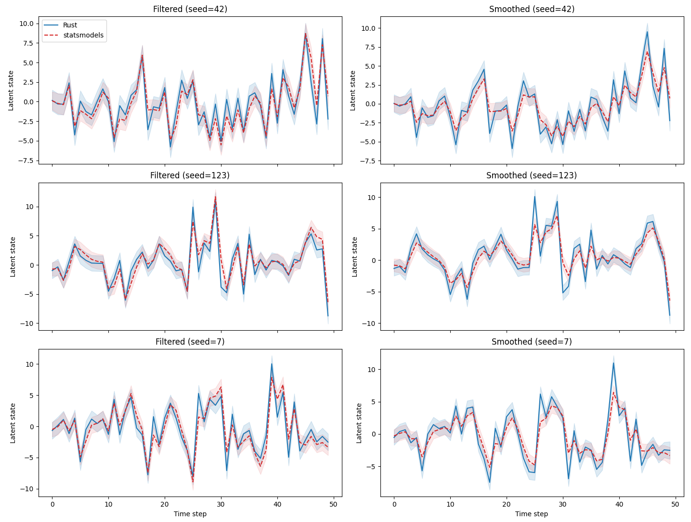
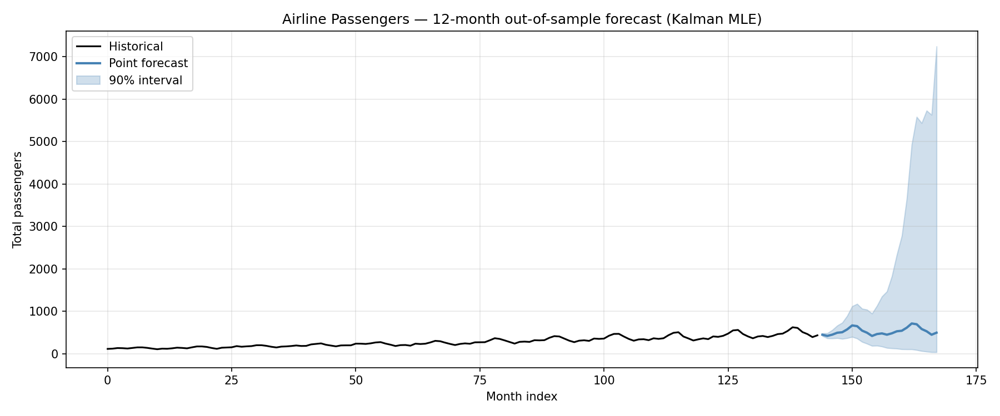

# state-space-rs

[](https://github.com/SaremS/state-space-rs/actions/workflows/CI.yml)
[](https://codecov.io/gh/SaremS/state-space-rs)

A Python extension module written in Rust using [PyO3](https://pyo3.rs) and [Maturin](https://www.maturin.rs).

## Comparison with statsmodels

See examples/python_visualization.py



## Airline Passengers Forecast

Maximum-likelihood estimation on the classic airline passengers dataset using our Kalman filter and `log_likelihood`. The data is preprocessed with log, lag-1 and lag-12 differencing; the forecast reverts all transforms. See [examples/airline_forecast.py](examples/airline_forecast.py).



## Prerequisites

- [Rust](https://rustup.rs/) (stable)
- Python ≥ 3.8
- [uv](https://github.com/astral-sh/uv)

## Setup

Create a virtual environment and install dependencies:

```bash
uv venv
source .venv/bin/activate
uv pip install maturin pytest
```

## Build

Compile the Rust code and install the module into your virtualenv:

```bash
maturin develop
```

For an optimised release build:

```bash
maturin develop --release
```

## Usage

```python
import numpy as np

from state_space_rs import GaussianDistribution, LinearGaussianSSM

model = LinearGaussianSSM(size_state=2, size_observation=2)
params = model.get_parameters()
model.set_parameters(params)

states, observations = model.sample(
    10,
    initial_state=GaussianDistribution(
        np.zeros(2),
        np.eye(2),
    ),
    seed=42,
)

filtered = model.filter_state(observations)
forecast = model.forecast(observations, 3)
```

### Available Classes

| Class | Key methods | Description |
|---|---|---|
| `LinearGaussianSSM` | `get_parameters`, `set_parameters`, `get_num_parameters`, `log_likelihood`, `forecast`, `filter_state`, `smooth_state`, `sample` | Linear Gaussian state-space model backed by `state-space-core` |
| `GaussianDistribution` | `mean`, `cov`, `log_prob` | Multivariate Gaussian distribution used for forecasts and filtered/smoothed state outputs |


### Python Visualization Example

A complete example that samples data, runs filtering/smoothing, and plots latent-state estimates with 90% intervals is available at:

```bash
python examples/python_visualization.py
```

This example requires `matplotlib`:

```bash
pip install matplotlib
```

## Development Workflow

After every code change, rebuild the library and re-run the tests:

```bash
maturin develop && pytest tests/ -v
```

For an optimised rebuild:

```bash
maturin develop --release && pytest tests/ -v
```
